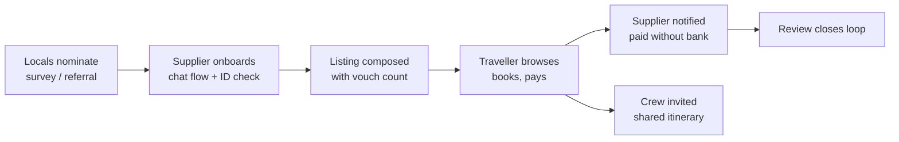

# PRD Context — Local Experience Marketplace

Marlon · 18 Sep 2026 · companion to `PRD.md.pdf`

This is the session-derived decision record: the why behind the build, the backlog reasoning, and the open questions that came out of the two 18 September team sessions (`docs/discussions/discussion1.md`, `discussion2.md`). `PRD.md.pdf` (Miles) is the authoritative spec — features, flows, MVP scope, demo script, build plan. Where the two disagree, the PRD position stands until the team settles it at hour 0; every such point is labelled inline below and listed in full in "Where this differs from the PRD."

## Problem

The businesses that make up a place's real culture are locked out of the tourism economy. Tourism is one of South Africa's largest GDP contributors, yet spend concentrates in hotels, lodges and aggregators. The home cook, the bicycle guide and the craft maker rarely see it.

They are excluded on three fronts at once:

- **Technology.** No website, no Instagram, no Airbnb listing. A phone with WhatsApp and prepaid data, not a laptop.
- **Finance.** Often unbanked. No business account, no card machine, no way to accept a payment from a tourist without cash.
- **Marketing.** No budget and no channel. They are known to their neighbours and invisible to everyone else.

Travellers lose too. Searching "best things to do in Cape Town" returns the same curated, aggregator-friendly list. The experiences people actually remember are the unplanned, local ones, and there is no way to find them on purpose.

Open question: how much of tourism spend stays with large operators versus reaching local entrepreneurs. A sourced figure belongs here. The PRD asks for the same thing (p.2, "to validate for the pitch"): "current SA unbanked/underbanked share, tourism's contribution to GDP and jobs, and the share of tourism spend reaching township and rural economies... a sourced figure or say 'approximately' — never an invented statistic on stage."

## Who we serve

Two users, one marketplace. The supplier is the one we are building for; the traveller is how they get paid.

|  | Supplier (supply side) | Traveller (demand side) |
| --- | --- | --- |
| Who | Local entrepreneur offering an experience, tour, meal, craft or service in their own area | Domestic or international visitor who wants an authentic experience, not the aggregator list |
| Examples | Cape Malay cooking class in a District Six home; bicycle tour through Khayelitsha; guided second-hand fashion walk through Woodstock; craft seller at Greenmarket Square | Group of friends planning a week in Cape Town; couple who booked a luxury lodge and want one real local day |
| Tech reality | Phone, WhatsApp, prepaid data. No laptop, no website, no social presence | Smartphone, comfortable with booking apps, expects Airbnb-grade UX |
| Money reality | Often unbanked or informally banked. Needs to receive payment without a bank account | Card, has money, wants to know it reaches the person running the experience |
| What they need from us | A way to list, get booked and get paid without becoming a tech business | A way to find what locals actually recommend, book it, and bring their crew |

We are explicitly not serving the polished operator with a five-star website and virtual tour. If they can list on Airbnb Experiences, they are not our supplier.

## Core idea

A two-sided marketplace where local businesses list with almost no friction, and travellers find them because locals vouched for them.

**Supply.** Onboarding assumes nothing: a conversational flow in a WhatsApp-style interface asks roughly ten questions, verifies identity, and composes the listing for the supplier *(session position — PRD differs, see below, #1)*. Bookings and confirmations arrive as messages. Payment works without a bank account.

**Demand.** A marketplace of these listings. The traveller browses, books, pays, sees it on their itinerary, invites their crew, and reviews afterwards.

**Differentiator: local vouching.** A listing on Airbnb Experiences exists because the operator uploaded it. A listing here carries a visible count of locals who recommended it, sourced from community surveys and nominations. The badge is only worth something if its provenance is legible on the listing: "37 Woodstock residents recommended this" is the product; a generic "Locally verified" sticker is not.

This moves community sourcing from a user-acquisition afterthought to the trust layer. It is also the safety story: identity verification plus community reputation, with security and insurance add-ons as later options. Treating vouching itself as a built MVP journey, rather than a Phase-2 flow, is a session position — see below, #5.

This is the session view of the flow; the PRD's solution-overview flow (p.6) differs at the onboarding step (voice note, not chat) and the checkout step (one group checkout with platform-held funds, not QR at the experience).

Money enters at the traveller and reaches the supplier directly, which is the trickle-down effect we are selling.

## Decisions made

Settled on 18 Sep across the two team sessions. Each one narrows what gets built. Rows marked below are session positions the PRD does not (yet) match — see "Where this differs from the PRD."

| Decision | Consequence |
| --- | --- |
| Supply side is the core product; demand side is how it gets paid | Onboarding and supplier payment get built first and get the most polish |
| Local vouching badges a listing; it does not gate it | Listings can exist from day one with no vouches. Vouch count is a ranking signal and a trust mark, so its provenance must be shown on the listing |
| "Invite others" means your own crew, not strangers *(session position — PRD differs, see below, #2)* | One booker invites by link, group size sits on the booking, everyone sees a shared itinerary. No open slots, no stranger matching, no social graph |
| PWA with WhatsApp look and feel, not a WhatsApp bot | Avoids Meta business verification and the coming per-message cost. WhatsApp is positioned as the next channel, not the MVP. Direct URL, no app store |
| Conversational supplier onboarding, roughly ten questions *(session position — PRD differs, see below, #1)* | The chat composes the listing. Suppliers never fill in a form or write copy |
| Identity verification is required, emulated for the demo | Stitch or Smile ID named as the production route. MVP collects ID details and verifies manually |
| Payment via QR at the point of experience; Send Money for the unbanked *(session position — PRD differs, see below, #3)* | No payment portal to build. Supplier gets a QR code; unbanked suppliers receive via cash-send to a phone number and any ATM |
| Offline-first data *(session position — PRD differs, see below, #4 — Henry owns the stack call)* | SQLite on device syncing to Postgres when connected. Itinerary and bookings work without signal |
| Stack: Next.js, API routes in the same repo, PWA manifest and service worker *(session position — PRD differs, see below, #4 — Henry owns the stack call)* | One repo, one framework, no separate backend |

## MVP scope

Four journeys. If all four work end to end, the demo tells the whole story.

**Supply**

1. Start onboarding in the chat-style flow *(session position — PRD differs, see below, #1)*
2. Identity check (details collected, verification emulated)
3. Answer roughly ten questions: what, where, when, price, group size, what to bring, photos *(session position — PRD differs, see below, #1)*
4. Listing composed and shown back for approval
5. Manage listings: edit, pause, set availability
6. Receive booking and confirmation as messages
7. Get paid: QR at the experience, or Send Money to a phone number *(session position — PRD differs, see below, #3)*

**Demand**

1. Browse listings, filter by area and interest
2. Open a listing: description, photos, price, supplier, vouch count with provenance
3. Book with a group size
4. Pay
5. See it on the itinerary
6. Review afterwards

**Crew** *(session position — PRD differs, see below, #2)*

1. Booker invites by link
2. Invitees see the shared itinerary
3. Group size reflected on the booking

**Vouches** *(session position — PRD differs, see below, #5)*

1. Each listing carries a vouch count and where it came from
2. Vouches rank listings in browse

For the prototype, vouch data is either seeded from a mock community survey or captured through a lightweight nominate-a-local flow the judges can try. Not yet decided.

## Backlog and open items

Discussed and deliberately demoted. Worth a mention in the pitch, not in the build.

| Feature | Why it is out of MVP |
| --- | --- |
| Drag-and-drop itinerary builder with crew voting *(session position — PRD differs, see below, #2: the PRD's must-demo #5 requires a shared, voted group itinerary)* | Demand-side feature on top of the core flow. Build only if the four journeys are done |
| Stokvel-style travel fund with debit-order contributions | Escrow, payments regulation, and a six-month horizon. Pitch slide, not code |
| Impact and green filters, sustainability-weighted ranking | Needs supplier data we will not have at demo time |
| Global currency wallet | Commodity feature; the judges will not score it |
| Security escort and insurance add-ons | Safety is addressed by ID verification plus community vouching. Add-ons are a later marketplace layer |
| Self-guided GPS audio tours, geofenced meetups | Exists elsewhere. Post-MVP "on the trip" mode |
| WhatsApp as a live channel | Blocked by Meta business verification and per-message cost. Next evolution, PWA emulates the feel |
| Facebook groups or Yazzie surveys as live sourcing | This is the vouch engine in production. For the demo it is seeded or a simple nominate flow |

## Where this differs from the PRD

Five points the two documents settle differently. None of these are silently resolved in favour of either document — the PRD holds until the team decides at hour 0.

**1. Onboarding mechanism**
- **PRD position:** Host records a voice note in their own language → speech-to-text → AI drafts the structured listing; a guided one-question-per-screen form is the fallback (p.3, USP pillar 1; p.8, "the single most important flow in the product and the demo's centrepiece").
- **Session position:** A conversational chat-style flow, roughly ten questions, composes the listing (discussion 2, MoSCoW must-have).
- **Status:** open — settle at hour 0.

**2. Group itinerary / crew voting**
- **PRD position:** The co-created, voted itinerary is the platform's most distinctive traveller feature (p.6); must-demo #5 is a shared day timeline with drag-and-drop (or tap-to-add) blocks, a simple vote, and lock (p.13). The PRD's own hour-0 list still leaves "drag-and-drop vs tap-to-add, and whether voting ships or organiser-lock only" open (p.21).
- **Session position:** A drag-and-drop itinerary builder with crew voting is backlog — "build only if the four journeys are done." "Invite others" means your own crew sees a shared itinerary, nothing more (discussion 1's original pitch; discussion 2's MoSCoW put itinerary builder + crew voting under "Nice to have (post-core)").
- **Status:** open — settle at hour 0.

**3. Payment model**
- **PRD position:** The platform collects from the traveller, holds the money, and pays the host after completion — escrow-style (p.9); funds held until completion, then released to the host (p.10). Real payments/bank linking are out of scope; payments are mocked at the hackathon (p.13).
- **Session position:** Payment via QR at the point of experience, "no payment portal to build"; Send Money to a phone number for the unbanked.
- **Status:** open — settle at hour 0. Both documents agree on cash-send to a phone number as the unbanked payout channel.

**4. Stack and offline**
- **PRD position:** Next.js PWA on Vercel; Supabase for auth, Postgres, storage, RLS and edge functions (p.17, headed "Team default, to be confirmed by the devs"). Offline sync is "Phase 2 for the build; design for it" (p.18).
- **Session position:** Next.js with API routes in the same repo, PWA manifest and service worker; SQLite on device syncing to Postgres; offline-first is an MVP decision.
- **Status:** open — settle at hour 0. Henry owns the stack call (discussion 2).

**5. Vouching scope**
- **PRD position:** Community Champions endorse hosts as a Tier-2 credential — "logged, visible as a badge, and revocable" (p.12); the community endorsement flow and Facebook forum aggregation are Phase 2 (p.13).
- **Session position:** "Vouches" is one of four MVP journeys — each listing carries a vouch count with visible provenance ("37 Woodstock residents recommended this"), and vouches rank listings (discussion 1 and discussion 2).
- **Status:** open — settle at hour 0. Both discussions agree that live sourcing (Yazzie/Facebook) is "not building for hackathon, but important to mention in pitch" — the open part is whether a vouch count ships as an MVP ranking signal or waits with the rest of community endorsement.

**Softer differences** (one line each; not scope-blocking):

- **WhatsApp:** PRD treats WhatsApp + SMS as first-class production channels (p.3, p.18) and mocks the WhatsApp accept on screen at the hackathon (p.13); Context positions WhatsApp as the *next* channel, PWA emulates the look and feel, Business API ruled out for Meta verification and per-message cost.
- **Identity:** PRD has tiered KYC — Tier 0 phone-verified draft-only, Tier 1 SA ID/passport + selfie, Tier 2 credential or community endorsement (p.7); Context says verification is required, emulated for the demo, Stitch or Smile ID named for production.
- **Security/Transport:** PRD shows them as listing categories gated behind Tier 2 in the UI (p.12, "Hackathon recommendation"); Context puts security escort and insurance add-ons out entirely.

Where both agree (not a conflict): the problem statement and the three exclusions (technology, finance, marketing/trust); supply side is the core product; cash-send payout to a phone number; PWA via direct URL, no app store; stokvel/travel fund out; impact/green filters out; GPS audio tours out; product name still open.

## Open items (hour 0 and beyond)

Merges the PRD's hour-0 decision list (p.20–21) with the open items this document already carried.

- [ ] Working name and one-line tagline — candidates: *Khaya Trails*, *Ubuntu Journeys*, *Local Ledger*, *Hlala*. Pick something a host can say and a judge can spell (PRD p.20)
- [ ] Demo language for voice-to-listing: isiXhosa, isiZulu or Afrikaans, based on an hour-0 speech-to-text test (PRD p.20)
- [ ] Demo persona and region set — PRD recommends Langa meal, Observatory bike tour, Stellenbosch tram, Soweto walk, Hogsback hike, Karoo farm (PRD p.21)
- [ ] Drag-and-drop vs tap-to-add for the itinerary, and whether voting ships or organiser-lock only (PRD p.21; this is also conflict #2 above)
- [ ] Fee shown in the demo — PRD recommends 15% so the host-receives number is clean (PRD p.21)
- [ ] Vouch data source for the prototype: seeded survey or nominate-a-local flow
- [ ] Sourced stat on tourism spend retained by large operators versus local entrepreneurs (the PRD asks for the same figure, p.2)
- [ ] Whether the demo runs a real Send Money or QR flow, or shows it as a mock
