# PRD Context — Local Experience Marketplace

Marlon · 18 Sep 2026 · written from docs/PRD.md (Miles)

This doc is derived from `PRD.md`, which is the decision of record for the build (`PRD.md.pdf` is the earlier export and is superseded). It adds the problem framing, who we serve, the reasoning behind what is in and out of the hackathon scope, and a compact record of what the two 18 September team sessions (`docs/discussions/discussion1.md`, `discussion2.md`) considered before the PRD settled these points.

## Problem

The businesses that make up a place's real culture are locked out of the tourism economy. Tourism is one of South Africa's largest GDP contributors, yet spend concentrates in hotels, lodges and aggregators. The home cook, the bicycle guide and the craft maker rarely see it.

They are excluded on three fronts at once:

- **Technology.** No website, no Instagram, no Airbnb listing. A phone with WhatsApp and prepaid data, not a laptop.
- **Finance.** Often unbanked. No business account, no card machine, no way to accept a payment from a tourist without cash.
- **Marketing.** No budget and no channel. They are known to their neighbours and invisible to everyone else.

Travellers lose too. Searching "best things to do in Cape Town" returns the same curated, aggregator-friendly list. The experiences people actually remember are the unplanned, local ones, and there is no way to find them on purpose. Groups of friends and family have no good way to plan a journey together, agree on it, and pay for it without one person carrying the cost (PRD → The Problem).

Open question: how much of tourism spend stays with large operators versus reaching local entrepreneurs. A sourced figure belongs here. The PRD asks for the same thing (PRD → The Problem, "to validate for the pitch"): "current SA unbanked/underbanked share, tourism's contribution to GDP and jobs, and the share of tourism spend reaching township and rural economies... a sourced figure or say 'approximately' — never an invented statistic on stage."

## Who we serve

Two users, one marketplace. The supplier is the one we are building for; the traveller is how they get paid.

|  | Supplier (supply side) | Traveller (demand side) |
| --- | --- | --- |
| Who | Local entrepreneur offering an experience, tour, meal, craft or service in their own area | Domestic or international visitor who wants an authentic experience, not the aggregator list |
| Examples | Cape Malay cooking class in a District Six home; bicycle tour through Khayelitsha; guided second-hand fashion walk through Woodstock; craft seller at Greenmarket Square | Group of friends planning a week in Cape Town; couple who booked a luxury lodge and want one real local day |
| Tech reality | Phone, WhatsApp, prepaid data. No laptop, no website, no social presence | Smartphone, comfortable with booking apps, expects Airbnb-grade UX |
| Money reality | Often unbanked or informally banked. Needs to receive payment without a bank account | Card, has money, wants to know it reaches the person running the experience |
| What they need from us | A way to list, get booked and get paid without becoming a tech business | A way to find what locals actually recommend, book it, bring their crew, and split the cost so nobody fronts the bill |

The PRD carries fuller persona tables (PRD → Users) — six host personas and four traveller personas — and names the group organiser as the demo persona: today they choose, pay and chase; the voted itinerary and stokvel-style pot remove all three. The PRD adds a fourth pitch persona for the demand side: the domestic group that would never book a R2,400 experience on one card but will happily put in R600 each.

We are explicitly not serving the polished operator with a five-star website and virtual tour. If they can list on Airbnb Experiences, they are not our supplier.

## Core idea

The PRD's one-line statement (PRD → One-Line Statement): "A marketplace that removes the technological and financial barriers on both sides of local South African tourism: hosts list by voice and get paid without a bank account, and groups of friends and family co-create their journey and pay for it together, stokvel-style, so nobody has to front the bill." Working name TBD.

**Supply.** A host records a voice note describing what they offer, in their own language. Speech-to-text transcribes it, an LLM drafts a structured listing, and the host reviews and corrects it — one field per screen — before publishing. Verification is tiered, so a phone number and an ID are enough to start.

**Demand.** Travellers browse listings by place, category or route. A group co-creates a journey together: anyone drags listings onto a shared day timeline, the group votes on each block, and the itinerary locks when everyone agrees. A group pot then opens for the total; each person pays their share from their own phone, and the bookings confirm when the pot is full. Each host accepts their own booking.

**What is new here** versus incumbents like Airbnb Experiences (PRD → Solution Overview, "What is new"): voice-to-listing in South African languages, community endorsement as a trust tier, unbanked payouts as a first-class flow, group co-creation with voting as the planning model, and stokvel-style split payment that removes the biggest barrier to booking a group experience.

```mermaid
flowchart LR
  A[Community surveyed<br/>WhatsApp / Facebook] --> B[Champion elected<br/>and inducted]
  B --> C[Host records voice note<br/>in own language]
  C --> D[AI drafts listing<br/>host reviews and publishes]
  D --> E[Travellers browse<br/>and co-build itinerary]
  E --> F[Group votes<br/>and fills the pot]
  F --> G[Host accepts<br/>via app or WhatsApp]
  G --> H[Experience happens]
  H --> I[Payout to phone number<br/>no bank account needed]
```

Reading left to right: supply is built by communities and champions, converted into listings by voice, consumed by groups planning and paying together, and closed by a payout the host can actually collect (PRD → Solution Overview).

Money enters at the traveller and reaches the supplier directly, which is the trickle-down effect we are selling.

## Decisions (per the PRD)

| Decision | Consequence for the build | Why |
| --- | --- | --- |
| Supply side first | When host simplicity and traveller convenience conflict, the host wins; onboarding and payout get the most polish | PRD design principle "Supply side first: when host simplicity and traveller convenience conflict, the host wins" (PRD → USP and Inclusion Principles, Design principles) |
| Voice-to-listing, guided form as fallback | Host records a voice note in their own language; speech-to-text transcribes, an LLM drafts the listing, host reviews one field per screen, adds 3 client-compressed photos, sees a suggested price, previews in the traveller's language, then publishes or saves offline. A one-question-per-screen form is the fallback | PRD calls this "the single most important supply-side flow and the first of the demo's two centrepieces" (PRD → Create an offering); USP pillar 1 (PRD → USP and Inclusion Principles) |
| Tiered KYC, OTP mocked | Tier 0 (phone verified) drafts only, not live; Tier 1 (SA ID/passport/permit + selfie) lists and accepts bookings up to a value cap; Tier 2 (credential or Community Champion endorsement) removes the cap, adds a verified badge, same-day payout. OTP is mocked at the hackathon | PRD → USP and Inclusion Principles, "verification that builds trust without re-excluding"; a payments partner carries FICA in production (Yoco, Peach, Ozow, Stitch, PayFast to validate) |
| Escrow-style collection from the pot, payout channels, "you will receive Rx", 15% demo fee, payments mocked | Platform collects from the travellers through the group pot and holds funds until completion, then pays the host — bank EFT, then cardless cash-send to phone (primary unbanked path), mobile wallet, cash pickup voucher, cash on the day as a bridge only. Host sees "You will receive Rx" before publishing; payout within 24h, same day for Tier 2. Demo runs at a 15% fee (R600 tour → "You will receive R510") | PRD → Get paid, "payouts that work without a bank account" (USP pillar 3); 15–20% is industry norm, 15% keeps the demo number clean (PRD → Decisions Needed and Open Questions) |
| Co-created group itinerary, vote + lock, opens the pot | Organiser starts a trip and invites the group; anyone drags (or taps to add) listings onto the day timeline; the group votes per block, conflicts are flagged, and the itinerary locks when the group agrees. The locked itinerary opens the group pot; each host accepts separately | PRD → Co-create the itinerary; Must demo #5 |
| Stokvel-style group payment (USP pillar 5) | Pot from the locked itinerary, equal split by default, organiser can adjust or cover a friend; each traveller pays their share by their own method (card, Apple/Google Pay, instant EFT, SnapScan/Zapper, cash-send voucher for unbanked travellers); progress and deadline visible to all, WhatsApp nudges to stragglers; hosts see request-to-book when the pot opens and a confirmed, fully paid booking when it fills; unfilled pot refunds automatically or the group shrinks and re-splits; payments mocked at the hackathon, with a "simulate contributions" button as the fallback | PRD → USP and Inclusion Principles (pillar 5); PRD → Book and pay together; Must demo #6 |
| Community Champion endorsement as a Tier-2 badge; endorsement flow is Phase 2 | Champions appear in the trust story on stage (elected locally, human on-ramp for hosts); logging and revoking an endorsement is not built for the hackathon | PRD → Trust, Safety and Compliance: "an endorsement is logged, visible as a badge, and revocable"; the endorsement flow and Facebook forum aggregation are Phase 2 (PRD → Hackathon MVP Scope, Phase 2) |
| PWA primary, WhatsApp/SMS as channels, WhatsApp mocked on screen | One PWA, reached by direct URL, no app store; WhatsApp and SMS carry notifications and simple actions, not the app itself; WhatsApp accept is shown as an on-screen mock message | PRD → Hackathon MVP Scope, Must demo; PRD → Tech Stack, Architecture and Non-Functional Requirements; avoids Meta business verification and the coming per-message cost — a concern the sessions raised (discussion 2) that the PRD's own build plan follows too |
| Offline designed for, sync in Phase 2 | Drafts, offerings and bookings are designed to work offline; the sync layer itself is not built for the hackathon | PRD → Tech Stack, Architecture and Non-Functional Requirements: "Phase 2 for the build; design for it now" |
| Stack: confirmed in docs/TECH_STACK.md | Next.js 15 (App Router) on Vercel, one codebase with a host shell (chat-style, text-first) and a traveller shell (visual timeline); Postgres on Supabase via Prisma; Supabase Auth (phone OTP) and Supabase Storage (public photos, private KYC documents); IndexedDB outbox for offline drafts; Claude for listing drafting, translation and search; Google Speech for speech-to-text; Tailwind with the `DESIGN.md` token set (Brandon's design system overrides the PRD's Specno Blue / Nunito / Inter brand line — see DESIGN.md → Status and Precedence); payments mocked. `TECH_STACK.md` is authoritative for the schema, the `/api/v1` contract and the repo layout. | PRD → Tech Stack, Architecture and Non-Functional Requirements: "Team default, to be confirmed by the devs" — confirmed by Henry in `docs/TECH_STACK.md` |

## Hackathon MVP scope (24 hours, per the PRD)

### Must demo

1. Host onboarding with phone OTP (mocked) and language selection.
2. Voice-to-listing in at least one language beyond English (isiXhosa or isiZulu preferred, Afrikaans fallback): record, transcribe, draft, host edits, publish. The first of the demo's two centrepieces.
3. Host earnings and payout screen showing a completed payout to a phone number (cash-send), with "you will receive Rx" shown before publishing.
4. Traveller marketplace: browse by place and category across 3–4 SA regions; listing detail with the host's story and verification badge.
5. Group itinerary: shared day timeline, drag-and-drop (or tap-to-add) blocks, simple vote, lock.
6. Stokvel-style group payment: a pot opens for the locked itinerary, split per person; each traveller pays their share from their own phone (payment mock or gateway sandbox); pot progress visible to all; bookings confirm when full. Host accept from the app; a WhatsApp accept shown as a mock message.
7. Seed data: 10–20 realistic listings from realistic personas in real places (Observatory bike tour, Stellenbosch tram, Langa home-cooked meal, Soweto walk, Hogsback hike, Karoo farm visit).

### Phase 2 — in the PRD, not the build

Tiered KYC with a real provider, real cash-send payouts, real pooled-funds escrow, recurring travel stokvel, WhatsApp onboarding channel, offline sync, AI itinerary planning, reviews, category templates for transport and security with credential checks, community endorsement flow, insurance partnership, Facebook forum aggregation.

### Explicitly out of scope

Accommodation, flights, native app-store apps, USSD, multi-currency settlement, rich in-app chat, loyalty, real payments or bank linking.

### Fallbacks if time runs short (decide at hour 12)

Drop drag-and-drop for tap-to-add; drop voting for organiser-only lock; drop live speech-to-text for a pre-recorded voice note with cached transcription; simulate the other travellers' pot contributions with a button rather than four real phones; keep the host payout screen and the group pot screen no matter what.

## Backlog: deliberately demoted

Discussed and deliberately demoted below the hackathon build. Worth a mention in the pitch, not in the code.

| Feature | Why it is out of MVP |
| --- | --- |
| Recurring travel stokvel — saving toward a trip over months | PRD → Book and pay together lists it as Phase 2; the *per-trip* stokvel-style pot is in the MVP (Must demo #6) |
| Impact and green filters, sustainability-weighted ranking | Needs supplier data we will not have at demo time |
| Global currency wallet | Commodity feature; the judges will not score it |
| Security escort and insurance add-ons | PRD shows Transport and Security as listing categories gated behind Tier 2 credentials in the UI (PRD → Offering Categories); insurance is a Phase 2 partnership to validate with a broker (PRD → Hackathon MVP Scope, Phase 2) |
| Self-guided GPS audio tours, geofenced meetups | Exists elsewhere. Post-MVP "on the trip" mode |
| WhatsApp as a live channel | PRD mocks the WhatsApp accept on screen at the hackathon (PRD → Hackathon MVP Scope, Must demo); the Business API integration is Phase 2 (PRD → Tech Stack, Architecture and Non-Functional Requirements) |
| Facebook groups or Yazzie surveys as live sourcing | This is the community endorsement flow the PRD lists as Phase 2 (PRD → Hackathon MVP Scope, Phase 2); for the demo, community sourcing is seeded |
| Accommodation | PRD: explicitly out of scope |
| Flights | PRD: explicitly out of scope |
| Native app-store apps | PRD: explicitly out of scope |
| USSD | PRD: explicitly out of scope (channels note says USSD is "later", PRD → Tech Stack, Architecture and Non-Functional Requirements) |
| Rich in-app chat | PRD: explicitly out of scope |
| Loyalty | PRD: explicitly out of scope |
| Real payments or bank linking | PRD: explicitly out of scope (PRD → Hackathon MVP Scope, Explicitly out of scope); payments are mocked at the hackathon; pooled funds need an escrow-capable partner in Phase 2 (PRD → Tech Stack, Payments) |

## Open items (hour 0)

The PRD's hour-0 decisions (PRD → Decisions Needed and Open Questions), plus the one figure still needing a source (PRD → The Problem).

- [ ] Working name and one-line tagline — candidates: *Khaya Trails*, *Ubuntu Journeys*, *Local Ledger*, *Hlala*. Pick something a host can say and a judge can spell (PRD → Decisions Needed and Open Questions)
- [ ] Demo language for voice-to-listing: isiXhosa, isiZulu or Afrikaans, based on an hour-0 speech-to-text test (PRD → Decisions Needed and Open Questions)
- [ ] Demo persona and region set — PRD recommends Langa meal, Observatory bike tour, Stellenbosch tram, Soweto walk, Hogsback hike, Karoo farm (PRD → Decisions Needed and Open Questions)
- [ ] Drag-and-drop vs tap-to-add for the itinerary, and whether voting ships or organiser-lock only (PRD → Decisions Needed and Open Questions)
- [ ] Fee shown in the demo — PRD recommends 15% so the host-receives number is clean (PRD → Decisions Needed and Open Questions)
- [ ] Sourced stat on tourism spend retained by large operators versus local entrepreneurs — a sourced figure or "approximately," never invented on stage (PRD → The Problem)
- [ ] Pot demo: four real phones, or two real phones plus simulated contributions? Decide by hour 2 and build the simulate button either way (PRD → Decisions Needed and Open Questions)

## Superseded session positions

The 18 September sessions leaned differently on six points before the PRD settled them; recorded here so the reasoning behind these superseded session positions is not lost (see PRD → Solution Overview, Supply-Side Flows, Demand-Side Flows and Tech Stack, Architecture and Non-Functional Requirements for the sections they touch).

| Topic | Sessions leaned toward | PRD decided |
| --- | --- | --- |
| Onboarding | Conversational chat, ~10 questions composes the listing | Voice-to-listing, guided form as fallback |
| Group itinerary | Drag-and-drop + crew voting is backlog; "invite" = shared itinerary only | Co-created, voted itinerary is must-demo #5 |
| Payments | QR at the point of experience, no payment portal | Platform collects at checkout through a stokvel-style group pot, holds funds, pays out after completion (mocked at hackathon). Both: cash-send to phone for the unbanked |
| Stack / offline | Next.js API routes + SQLite-on-device syncing to Postgres, offline-first at MVP | Next.js on Vercel + Supabase, offline is Phase 2, devs to confirm |
| Vouching | Per-listing vouch count with provenance as an MVP journey | Community Champion endorsement as a Tier-2 badge; endorsement flow is Phase 2 |
| Stokvel travel fund | Pitch slide, not code — escrow regulation and a six-month horizon | Per-trip stokvel-style pot is Must demo #6; the recurring saving stokvel is Phase 2 |
