# PRD Context — Local Experience Marketplace

Marlon · 18 Sep 2026 · written from PRD.md.pdf (Miles)

This doc is derived from `PRD.md.pdf`, which is the decision of record for the build. It adds the problem framing, who we serve, the reasoning behind what is in and out of the hackathon scope, and a compact record of what the two 18 September team sessions (`docs/discussions/discussion1.md`, `discussion2.md`) considered before the PRD settled these points.

## Problem

The businesses that make up a place's real culture are locked out of the tourism economy. Tourism is one of South Africa's largest GDP contributors, yet spend concentrates in hotels, lodges and aggregators. The home cook, the bicycle guide and the craft maker rarely see it.

They are excluded on three fronts at once:

- **Technology.** No website, no Instagram, no Airbnb listing. A phone with WhatsApp and prepaid data, not a laptop.
- **Finance.** Often unbanked. No business account, no card machine, no way to accept a payment from a tourist without cash.
- **Marketing.** No budget and no channel. They are known to their neighbours and invisible to everyone else.

Travellers lose too. Searching "best things to do in Cape Town" returns the same curated, aggregator-friendly list. The experiences people actually remember are the unplanned, local ones, and there is no way to find them on purpose.

Open question: how much of tourism spend stays with large operators versus reaching local entrepreneurs. A sourced figure belongs here. The PRD asks for the same thing (p.2, "to validate for the pitch"): "current SA unbanked/underbanked share, tourism's contribution to GDP and jobs, and the share of tourism spend reaching township and rural economies... a sourced figure or say 'approximately' — never an invented statistic on stage."

## Who we serve

Two users, one marketplace. The supplier is the one we are building for; the traveller is how they get paid.

|  | Supplier (supply side) | Traveller (demand side) |
| --- | --- | --- |
| Who | Local entrepreneur offering an experience, tour, meal, craft or service in their own area | Domestic or international visitor who wants an authentic experience, not the aggregator list |
| Examples | Cape Malay cooking class in a District Six home; bicycle tour through Khayelitsha; guided second-hand fashion walk through Woodstock; craft seller at Greenmarket Square | Group of friends planning a week in Cape Town; couple who booked a luxury lodge and want one real local day |
| Tech reality | Phone, WhatsApp, prepaid data. No laptop, no website, no social presence | Smartphone, comfortable with booking apps, expects Airbnb-grade UX |
| Money reality | Often unbanked or informally banked. Needs to receive payment without a bank account | Card, has money, wants to know it reaches the person running the experience |
| What they need from us | A way to list, get booked and get paid without becoming a tech business | A way to find what locals actually recommend, book it, and bring their crew |

The PRD carries fuller persona tables — six host personas (p.5) and four traveller personas (p.5–6) — and names the group organiser as the demand-side persona the demo should centre on, since the co-created, voted itinerary is the platform's most distinctive traveller feature (p.6).

We are explicitly not serving the polished operator with a five-star website and virtual tour. If they can list on Airbnb Experiences, they are not our supplier.

## Core idea

The PRD's one-line statement (p.1): "A marketplace that removes the technological and financial barriers keeping local South Africans out of the tourism economy, so anyone with something authentic to offer can list it by voice, get booked by travellers co-planning their journey, and get paid — without a bank account, a website, or reliable data." Working name TBD.

**Supply.** A host records a voice note describing what they offer, in their own language. Speech-to-text transcribes it, an LLM drafts a structured listing, and the host reviews and corrects it — one field per screen — before publishing. Verification is tiered, so a phone number and an ID are enough to start.

**Demand.** Travellers browse listings by place, category or route. A group co-creates a journey together: anyone drags listings onto a shared day timeline, the group votes on each block, and the itinerary locks when everyone agrees. One checkout pays for the whole trip; each host accepts their own booking.

**What is new here** versus incumbents like Airbnb Experiences (PRD p.7): voice-to-listing in South African languages, community endorsement as a trust tier, unbanked payouts as a first-class flow, and group co-creation with voting as the planning model.

```mermaid
flowchart LR
  A[Community surveyed<br/>WhatsApp / Facebook] --> B[Champion elected<br/>and inducted]
  B --> C[Host records voice note<br/>in own language]
  C --> D[AI drafts listing<br/>host reviews and publishes]
  D --> E[Travellers browse<br/>and co-build itinerary]
  E --> F[Group votes<br/>and pays once]
  F --> G[Host accepts<br/>via app or WhatsApp]
  G --> H[Experience happens]
  H --> I[Payout to phone number<br/>no bank account needed]
```

Reading left to right: supply is built by communities and champions, converted into listings by voice, consumed by groups planning together, and closed by a payout the host can actually collect (PRD p.6).

Money enters at the traveller and reaches the supplier directly, which is the trickle-down effect we are selling.

## Decisions (per the PRD)

| Decision | Consequence for the build | Why |
| --- | --- | --- |
| Supply side first | When host simplicity and traveller convenience conflict, the host wins; onboarding and payout get the most polish | PRD design principle (p.4); "the unique value is on the supply side" (p.3) |
| Voice-to-listing, guided form as fallback | Host records a voice note in their own language; speech-to-text transcribes, an LLM drafts the listing, host reviews one field per screen, adds 3 client-compressed photos, sees a suggested price, previews in the traveller's language, then publishes or saves offline. A one-question-per-screen form is the fallback | PRD calls this "the single most important flow in the product and the demo's centrepiece" (p.8); USP pillar 1 (p.3) |
| Tiered KYC, OTP mocked | Tier 0 (phone verified) drafts only, not live; Tier 1 (SA ID/passport/permit + selfie) lists and accepts bookings up to a value cap; Tier 2 (credential or Community Champion endorsement) removes the cap, adds a verified badge, same-day payout. OTP is mocked at the hackathon | PRD p.7, "verification that builds trust without re-excluding"; a payments partner carries FICA in production (Yoco, Peach, Ozow, Stitch, PayFast to validate) |
| Escrow-style collection, payout channels, "you will receive Rx", 15% demo fee, payments mocked | Platform collects from the traveller at checkout and holds funds until completion, then pays the host — bank EFT, then cardless cash-send to phone (primary unbanked path), mobile wallet, cash pickup voucher, cash on the day as a bridge only. Host sees "You will receive Rx" before publishing; payout within 24h, same day for Tier 2. Demo runs at a 15% fee (R600 tour → "You will receive R510") | PRD p.9–10, "payouts that work without a bank account" (USP pillar 3); 15–20% is industry norm, 15% keeps the demo number clean (p.21) |
| Co-created group itinerary, vote + lock, one checkout | Organiser starts a trip and invites the group; anyone drags (or taps to add) listings onto the day timeline; the group votes per block, conflicts are flagged, and the itinerary locks when the group agrees. One checkout pays for everything; each host accepts separately | PRD calls this "our distinctive demand feature" (p.10) and must-demo #5 (p.13) |
| Community Champion endorsement as a Tier-2 badge; endorsement flow is Phase 2 | Champions appear in the trust story on stage (elected locally, human on-ramp for hosts); logging and revoking an endorsement is not built for the hackathon | PRD p.12: "an endorsement is logged, visible as a badge, and revocable"; the endorsement flow and Facebook forum aggregation are Phase 2 (p.13) |
| PWA primary, WhatsApp/SMS as channels, WhatsApp mocked on screen | One PWA, reached by direct URL, no app store; WhatsApp and SMS carry notifications and simple actions, not the app itself; WhatsApp accept is shown as an on-screen mock message | PRD p.13, p.17–18; avoids Meta business verification and the coming per-message cost — a concern the sessions raised (discussion 2) that the PRD's own build plan follows too |
| Offline designed for, sync in Phase 2 | Drafts, offerings and bookings are designed to work offline; the sync layer itself is not built for the hackathon | PRD p.18: "Phase 2 for the build; design for it now" |
| Stack: Next.js + Supabase on Vercel, to be confirmed by Henry | One Next.js codebase, two shells (host: WhatsApp-like, text-first; traveller: visual timeline); Supabase for auth, Postgres, storage, RLS and edge functions | PRD p.17, headed "Team default, to be confirmed by the devs"; Henry owns the stack call (discussion 2) |

## Hackathon MVP scope (24 hours, per the PRD)

### Must demo

1. Host onboarding with phone OTP (mocked) and language selection.
2. Voice-to-listing in at least one language beyond English (isiXhosa or isiZulu preferred, Afrikaans fallback): record, transcribe, draft, host edits, publish. The centrepiece.
3. Host earnings and payout screen showing a completed payout to a phone number (cash-send), with "you will receive Rx" shown before publishing.
4. Traveller marketplace: browse by place and category across 3–4 SA regions; listing detail with the host's story and verification badge.
5. Group itinerary: shared day timeline, drag-and-drop (or tap-to-add) blocks, simple vote, lock.
6. Booking with a convincing payment mock (or gateway sandbox) and host accept from the app; WhatsApp accept shown as a mock message.
7. Seed data: 10–20 realistic listings from realistic personas in real places (Observatory bike tour, Stellenbosch tram, Langa home-cooked meal, Soweto walk, Hogsback hike, Karoo farm visit).

### Phase 2 — in the PRD, not the build

Tiered KYC with a real provider, real cash-send payouts, WhatsApp onboarding channel, offline sync, AI itinerary planning, reviews, category templates for transport and security with credential checks, community endorsement flow, insurance partnership, Facebook forum aggregation.

### Explicitly out of scope

Accommodation, flights, native app-store apps, USSD, multi-currency settlement, rich in-app chat, loyalty, real payments or bank linking.

### Fallbacks if time runs short (decide at hour 12)

Drop drag-and-drop for tap-to-add; drop voting for organiser-only lock; drop live speech-to-text for a pre-recorded voice note with cached transcription; keep the payout screen no matter what.

## Backlog: deliberately demoted

Discussed and deliberately demoted below the hackathon build. Worth a mention in the pitch, not in the code.

| Feature | Why it is out of MVP |
| --- | --- |
| Stokvel-style travel fund with debit-order contributions | Escrow, payments regulation, and a six-month horizon. Pitch slide, not code |
| Impact and green filters, sustainability-weighted ranking | Needs supplier data we will not have at demo time |
| Global currency wallet | Commodity feature; the judges will not score it |
| Security escort and insurance add-ons | PRD shows Transport and Security as listing categories gated behind Tier 2 credentials in the UI (p.12); insurance is a Phase 2 partnership to validate with a broker (p.12–13) |
| Self-guided GPS audio tours, geofenced meetups | Exists elsewhere. Post-MVP "on the trip" mode |
| WhatsApp as a live channel | PRD mocks the WhatsApp accept on screen at the hackathon (p.13); the Business API integration is Phase 2 (p.17) |
| Facebook groups or Yazzie surveys as live sourcing | This is the community endorsement flow the PRD lists as Phase 2 (p.13); for the demo, community sourcing is seeded |
| Accommodation | PRD: explicitly out of scope |
| Flights | PRD: explicitly out of scope |
| Native app-store apps | PRD: explicitly out of scope |
| USSD | PRD: explicitly out of scope (channels note says USSD is "later", p.18) |
| Rich in-app chat | PRD: explicitly out of scope |
| Loyalty | PRD: explicitly out of scope |
| Real payments or bank linking | PRD: explicitly out of scope; payments are mocked at the hackathon (p.13) |

## Open items (hour 0)

The PRD's hour-0 decisions (p.20–21), plus the one figure still needing a source (p.2).

- [ ] Working name and one-line tagline — candidates: *Khaya Trails*, *Ubuntu Journeys*, *Local Ledger*, *Hlala*. Pick something a host can say and a judge can spell (PRD p.20)
- [ ] Demo language for voice-to-listing: isiXhosa, isiZulu or Afrikaans, based on an hour-0 speech-to-text test (PRD p.20)
- [ ] Demo persona and region set — PRD recommends Langa meal, Observatory bike tour, Stellenbosch tram, Soweto walk, Hogsback hike, Karoo farm (PRD p.21)
- [ ] Drag-and-drop vs tap-to-add for the itinerary, and whether voting ships or organiser-lock only (PRD p.21)
- [ ] Fee shown in the demo — PRD recommends 15% so the host-receives number is clean (PRD p.21)
- [ ] Sourced stat on tourism spend retained by large operators versus local entrepreneurs — a sourced figure or "approximately," never invented on stage (PRD p.2)

## Superseded session positions

The 18 September sessions leaned differently on five points before the PRD settled them; recorded here so the reasoning behind these superseded session positions is not lost (see PRD p.6–13 for the sections they touch).

| Topic | Sessions leaned toward | PRD decided |
| --- | --- | --- |
| Onboarding | Conversational chat, ~10 questions composes the listing | Voice-to-listing, guided form as fallback |
| Group itinerary | Drag-and-drop + crew voting is backlog; "invite" = shared itinerary only | Co-created, voted itinerary is must-demo #5 |
| Payments | QR at the point of experience, no payment portal | Platform collects at checkout, holds funds, pays out after completion (mocked at hackathon). Both: cash-send to phone for the unbanked |
| Stack / offline | Next.js API routes + SQLite-on-device syncing to Postgres, offline-first at MVP | Next.js on Vercel + Supabase, offline is Phase 2, devs to confirm |
| Vouching | Per-listing vouch count with provenance as an MVP journey | Community Champion endorsement as a Tier-2 badge; endorsement flow is Phase 2 |
